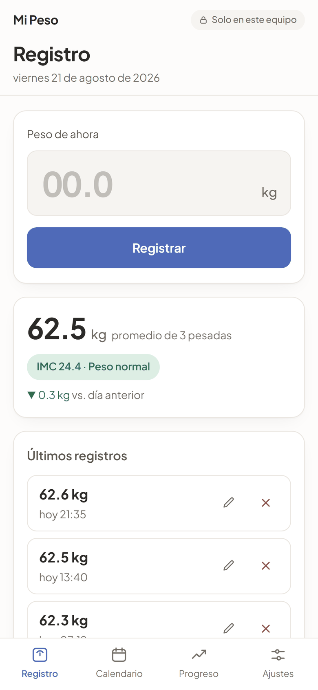
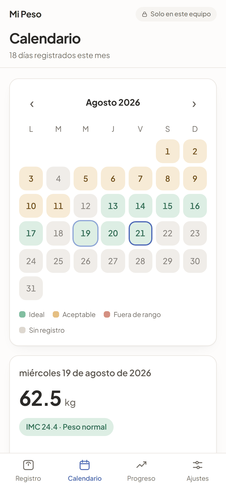
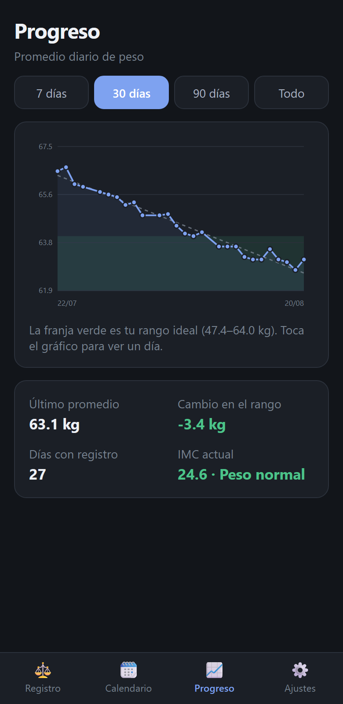
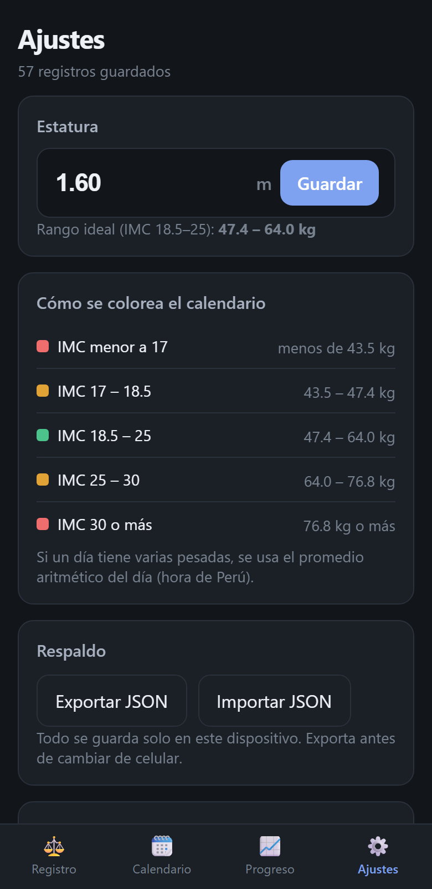

<div align="center">

# Mi Peso

**Registro de peso corporal e IMC que nunca sale del teléfono.**
Aplicación web instalable (PWA) y APK de Android construidos desde una sola base de código.

[](https://github.com/oscardanielnc/control-weight/actions/workflows/ci.yml)
[](https://github.com/oscardanielnc/control-weight/actions/workflows/apk.yml)
[](LICENSE)

[Sitio del producto](https://weightlog.oscarnavarro.dev/) ·
[Descargar el APK](https://github.com/oscardanielnc/control-weight/releases/latest) ·
[Arquitectura](docs/ARQUITECTURA.md) ·
[Seguridad](SECURITY.md)






</div>

---

## Qué hace

Anotar el peso en dos toques y ver qué está pasando con él:

| Pantalla | Qué resuelve |
|---|---|
| **Registro** | Es lo primero que aparece al abrir: campo de peso y botón *Registrar*. Guarda fecha y hora exactas de Perú, muestra el promedio del día con su IMC y la diferencia contra el día anterior. |
| **Calendario** | Cada día se pinta según el IMC del **promedio de ese día**: verde en el rango ideal, ámbar cerca del límite, rojo fuera de rango, gris si no hubo registro. Un toque abre el detalle con todas las pesadas. |
| **Progreso** | Peso contra tiempo, con la franja del rango ideal de fondo y una línea de tendencia por mínimos cuadrados. Filtros de 7 / 30 / 90 días o todo el historial. |
| **Ajustes** | Estatura (base del IMC), la tabla de colores traducida a kilos, respaldo en JSON y borrado total con doble confirmación. |

## Reglas de negocio

- **Hora de Perú.** Perú es UTC−5 fijo desde 1994, sin horario de verano. Cada registro guarda el
  instante UTC *y* la fecha y hora de Lima ya resueltas, de modo que el día al que pertenece una
  pesada no depende de la zona horaria configurada en el equipo.
- **Un día, un valor.** Si hay varias pesadas en el mismo día se usa el promedio aritmético.
- **Cortes de IMC de la OMS**, traducidos a kilos para una estatura de 1.60 m:

  | IMC | Color | Peso |
  |---|---|---|
  | < 17 | rojo | menos de 43.5 kg |
  | 17 – 18.5 | ámbar | 43.5 – 47.4 kg |
  | **18.5 – 25** | **verde** | **47.4 – 64.0 kg** |
  | 25 – 30 | ámbar | 64.0 – 76.8 kg |
  | ≥ 30 | rojo | 76.8 kg o más |

- **Validación.** Peso entre 20 y 300 kg con un decimal; estatura entre 1.00 y 2.50 m.

> Mi Peso es una herramienta de seguimiento personal, no un dispositivo médico. El IMC es un
> indicador orientativo y no distingue masa muscular de grasa.

## Tecnología

| Capa | Elección | Por qué |
|---|---|---|
| Interfaz | React 19 + TypeScript en modo estricto | Componentes pequeños y tipos que cubren el dominio (zonas de IMC, resúmenes diarios). |
| Estado | `useSyncExternalStore` sobre la base de datos | Una sola fuente de verdad: cualquier escritura revalida todas las pantallas sin propagar contadores por props. |
| Datos | SQLite compilado a WebAssembly (`sql.js`) | Los promedios, máximos y conteos por día salen de una consulta agrupada, no de recorrer arreglos en JavaScript. |
| Persistencia | Archivo SQLite volcado a IndexedDB | Escrituras agrupadas con retardo y volcado forzado cuando la app pasa a segundo plano. |
| Gráficos | SVG escrito a mano | Un gráfico de línea con tendencia y banda no justifica una librería de 100 kB. |
| Empaquetado | Vite 8 · vite-plugin-pwa (Workbox) · Capacitor 8 | La misma compilación se instala desde el navegador o se empaqueta como APK. |
| Calidad | Vitest · oxlint · `tsc` · GitHub Actions | 30 pruebas, incluidas las de SQLite real en memoria. |
| Publicación | GitHub Pages y Nginx sobre Oracle Cloud | Mismo artefacto en ambos destinos, generado por `npm run sitio`. |

Los porqués con más detalle están en [docs/ARQUITECTURA.md](docs/ARQUITECTURA.md) y
[docs/DECISIONES.md](docs/DECISIONES.md).

## Estructura del repositorio

```
apps/
  app/                 aplicación PWA + proyecto Android (Capacitor)
    src/lib/           dominio: fechas de Perú, IMC, esquema y consultas SQLite
    src/estado/        proveedor de datos y hooks (useConsulta)
    src/screens/       Registro · Calendario · Progreso · Ajustes
    android/           proyecto nativo que produce el APK
  landing/             sitio de producto (HTML, CSS y un script, sin dependencias)
deploy/                configuración de Nginx y script de despliegue a la VM
docs/                  arquitectura, decisiones y despliegue
scripts/               armado del sitio publicable (landing + /app)
.github/workflows/     CI, publicación del sitio y compilación del APK
```

## Desarrollo

Requiere Node 22 o superior.

```bash
npm install          # instala las dependencias de todo el monorepo
npm run dev          # aplicación en http://localhost:5173
npm run dev:landing  # sitio de producto
npm test             # 30 pruebas (Vitest)
npm run verificar    # linter + tipos + pruebas + compilación: lo mismo que hace CI
npm run sitio        # arma sitio/ con el landing en la raíz y la app en /app
```

## Instalación en el teléfono

**APK.** Descárgalo de la [última versión publicada](https://github.com/oscardanielnc/control-weight/releases/latest),
ábrelo en el teléfono y permite la instalación desde esa fuente. El archivo `.sha256` que acompaña
a cada versión permite verificar que el APK es el que salió de la compilación pública.

**Aplicación web.** Abre el sitio en Chrome y elige *Agregar a pantalla de inicio*. Queda con su
icono, a pantalla completa y funciona sin conexión.

Para compilar el APK en tu propia máquina hacen falta JDK 21 y el SDK de Android:

```bash
npm run apk          # compila, sincroniza Capacitor y genera el APK de depuración
npm run android:studio
```

Sin nada instalado, el flujo **APK de Android** de GitHub Actions lo compila en la nube.

## Despliegue

`npm run sitio` produce la carpeta `sitio/`, que es lo único que se publica:

- **weightlog.oscarnavarro.dev**: la VM de Oracle sirve el sitio con Nginx en un contenedor,
  publicado por el túnel de Cloudflare que termina el TLS (`deploy/docker/`).
- **GitHub Pages**: espejo automático en cada empuje a `main` (flujo `pages.yml`).
- **VM de Oracle Cloud**: `./deploy/desplegar.sh usuario@ip` compila, verifica y sincroniza por
  rsync; Nginx sirve los archivos con la configuración de [`deploy/nginx/`](deploy/nginx/).

Los pasos completos del servidor —certificados, cortafuegos y comprobación de cabeceras— están en
[docs/DESPLIEGUE.md](docs/DESPLIEGUE.md).

## Privacidad

No hay servidor, cuenta ni telemetría: el historial vive en el dispositivo y la aplicación no tiene
a dónde enviarlo. La política de contenido de la compilación de producción restringe todo al propio
origen y el APK desactiva la copia de seguridad automática de Android. El detalle, junto con el
modelo de amenazas, está en [SECURITY.md](SECURITY.md).

Como los datos solo existen en el teléfono, **exporta el respaldo JSON antes de cambiar de equipo o
desinstalar la aplicación**.

## Licencia

[MIT](LICENSE) · Oscar Navarro
